# 追风考试系统 
[](https://gitee.com/wzhouzhou/exam_system/stargazers)[](https://gitee.com/wzhouzhou/exam_system/members)

[](https://gitee.com/wzhouzhou/exam_system)

追风考试系统是一个多角色在线培训考试系统，系统集成了用户管理、角色管理、题库管理、试

题管理、考试管理、在线考试等功能，考试流程完善。实现一整套完整体系的考试系统，方便用

户在此系统中进行练习并不断提升自己，在考试中不断进步。

> 由于群主之前号被黑,之前的群已被解散, 如果想重新入群就戳这里 > 372964554

> 群主目前也会不定期直播写新项目哦, 欢迎各位哦~

`请务必将文档看完, 很多问题都可以在文档中找到解决, 也可以加入群一起交流, 群号: 372964554 下面也会有二维码`

<div style="text-align: center">

</div>
- # [ :point_right: 线上体验](http://exam.wzzz.fun)
``` 
   管理员账号: wzz 
   密码: 12345
   Tips: 为了各位有良好的体验,请不要更改演示账号的权限以及地址, 如账号异常,请加q群970804317私信群主~!
```
- [码云地址](https://gitee.com/wzhouzhou/exam_system)
- [Github地址(不同步更新)]()

## 快速启动

[快速部署运行Doc](./QuickStart.md)

## 更新记录

[ReleaseNote](./ReleaseNote.md)

## 技术栈

> 1. SpringBoot
> 2. Mybatis-plus
> 3. MySQL 5.7
> 4. Vue全家桶
> 5. ElementUI
> 6. Redis
> 7. Swagger
> 8. 阿里云OSS
> 9. Log4j

## 主要功能

**1.** **权限控制**

本系统存在三个不同的角色，教师，管理员，学生三种用户，此系统是基于vue+springboot实现的前后端分离，用户权限校验通过JWT生成token令牌发放到用户，并根据令牌对用户的身份合法性进行校验。

**2.** **在线考试**

学生用户在注册登录之后，可以在本系统进行在线的考试，考试可由教师和管理员进行布置并设置考试权限（公开，密码），考试题型分为 单选、多选、判断、简答题，并支持题目附带配图。考试过程中需开启摄像头进行考试，系统会自动抓拍考生实时考试状态。

**3.** **成绩模块**

参加考试后的学生用户，在提交试卷后进入考试结果页面，页面会自动核对学生用户的逻辑题的对错，对于简答题需要老师或者超级管理员进行批阅。对于学生用户参与的考试，学生用户可以查看到考试的详情并可以查看到自己所错的逻辑题。

**4.** **题库模块**

学生用户在题库模块中可以进行题目的功能训练，训练模式分为，顺序练习，随机练习，也可以根据题型练习（单选，多选，判断）。用户答题时会实时判断正确与否，并有错题解析功能。

**5.** **题库管理**

超级管理员和教师可以对本考试系统已有的题库进行管理，实现对题库信息的CRUD操作

**6.** **试题管理**

教师和系统管理员用户有权限对本系统的所有试题进行操作，本系统试题支持复杂类型的题目，考试题目支持多插图，选项答案支持单插图功能。

**7.** **考试管理**

教师和系统管理员用户有权限对系统存在的考试进行操作，本系统考试支持公开考试和密码口令考试，并可以对考试进行禁用也可以在设置考试时间段，对于考试可以进行很便利的进行组卷，系统内置两种组卷模式，题库组卷和自由选题组卷。

**8.** **考卷批阅**

对于本系统中存在的复杂考试的题目，可以又对应的老师进行批阅，此系统的逻辑题无需老师用户进行批阅，老师的工作仅仅是批阅简答题这种无准确答案类型的题目，极大地减轻了老师用户的工作量

**9.** **考试统计**

本系统针对每一次考试进行数据统计和报表，让使用本系统的老师用户能够直观的了解到每一次考试人员的进步。

**10.** **用户管理**

超级管理员可以对注册本系统用户的进行授权，并拥有操作一切用户的权限。

## 项目预览(仅展示部分核心功能)

### 证书发放功能

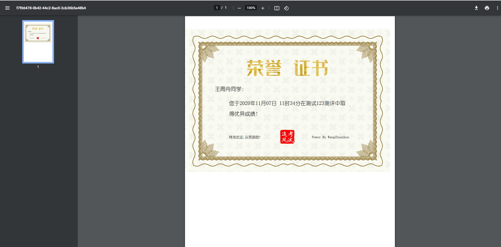

### 公告功能

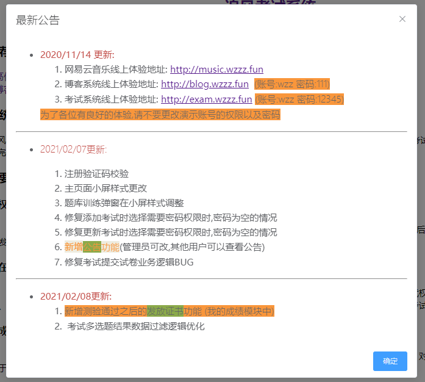

### 登录页

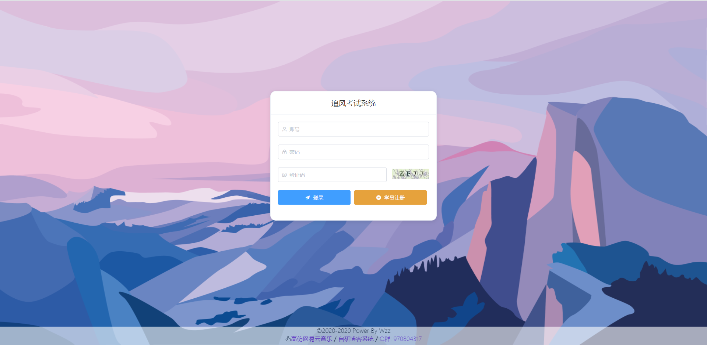

### 考试页面

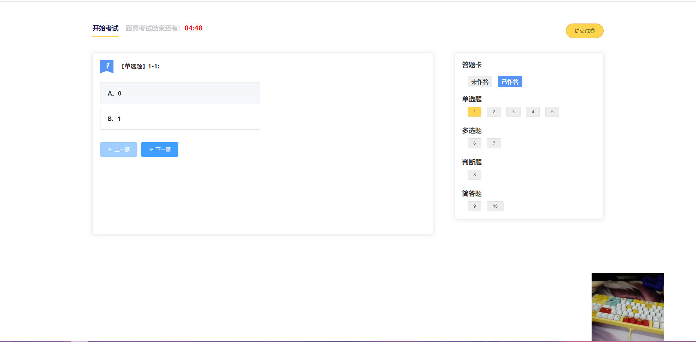

### 考试结果

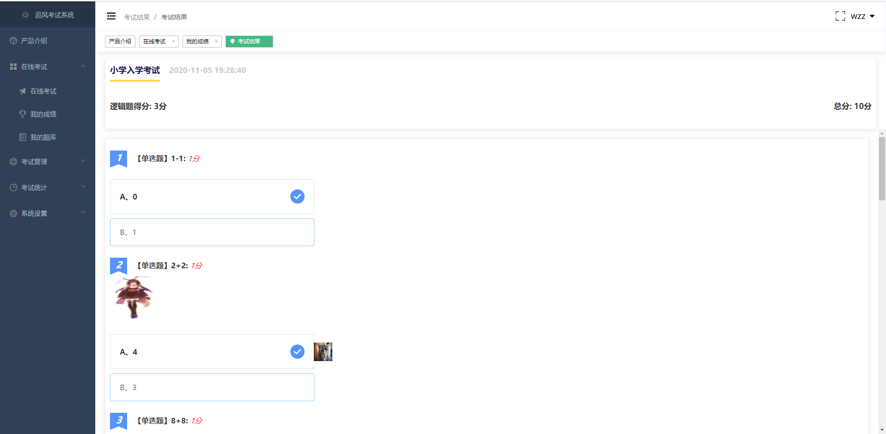

### 题库训练

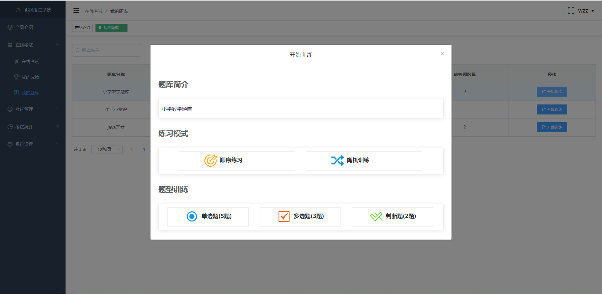

### 题库训练

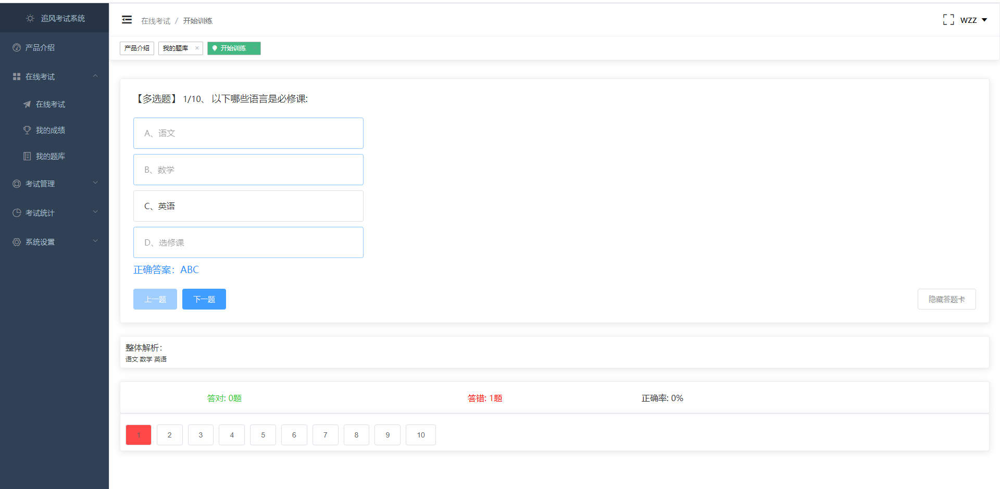

### 试题管理

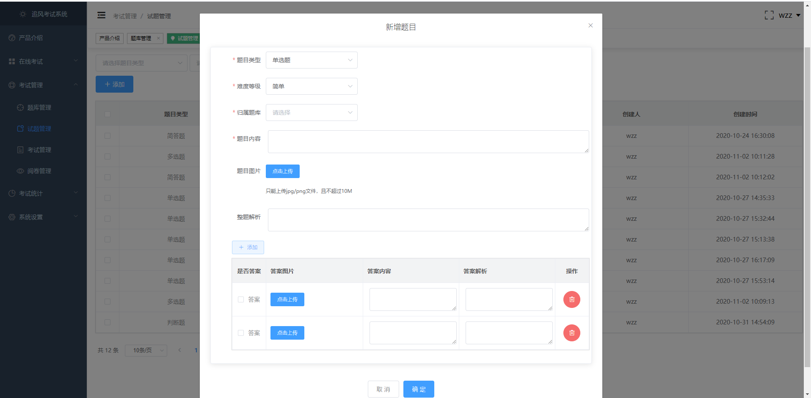

### 考试管理

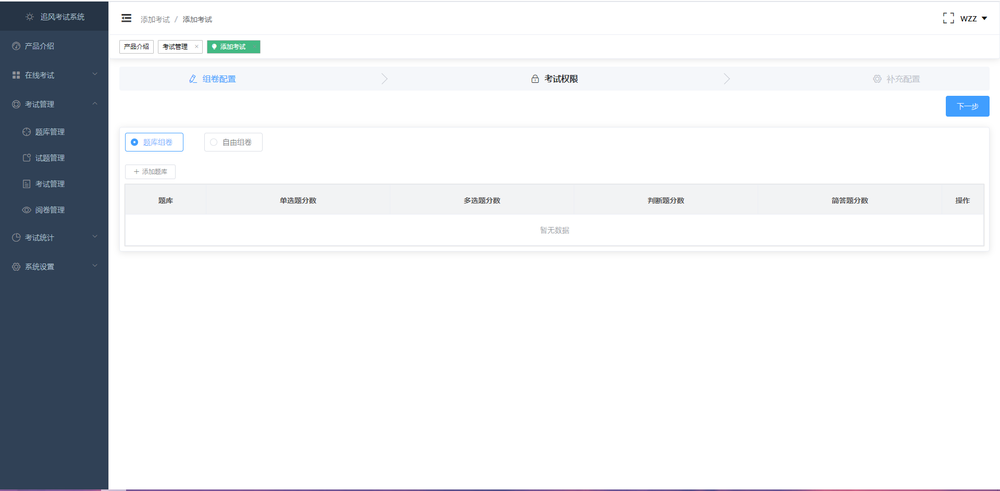

### 考试数据可视化

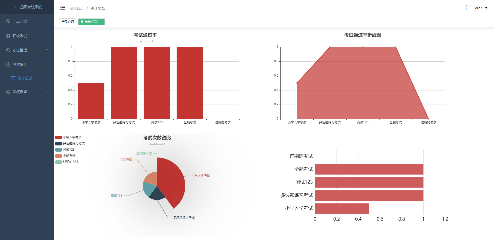

### 用户和权限管理

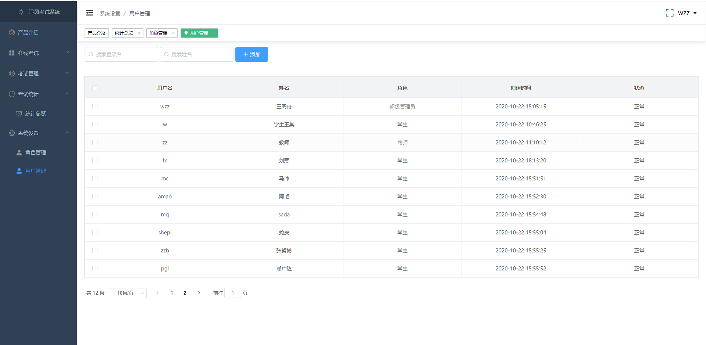

## 警告

> 1. 本项目仅用于学习使用, 本人不承担任何恶意使用后果
> 2. 本项目代码遵循开源协议

## 致谢

本项目UI样式参考以下项目：

1. [云帆考试系统](https://gitee.com/davz/yf-exam-lite)

## 推荐

[SpringBoot个人博客](https://github.com/wzz1206414629/privateBlog)

[高仿网易云音乐](https://gitee.com/wzhouzhou/vue_wzz_cloudMusic)

## 问题

- 开发学习问题或者好的建议可以给出反馈交流, 一起学习
- 请在提问前先完成以下过程：
    * 请仔细阅读本项目文档，查看能否解决；
    * 百度或谷歌相关技术；
    * 查看相关技术的官方文档
    * 请提问前尽可能做一些思考分析，然后提问时给出详细的信息以及个人对问题的理解。

希望能与大家成为开发路上的好朋友~! 期待与你相遇~

- License

Copyright (c) 2020-2022 by person -> wangzhouzhou

